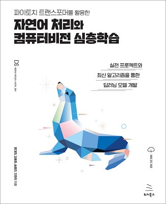

# KDT05(Korea Digital Training)- NLP(24.3.28 ~ 24.4.5)

교재 : 파이토치 트랜스포머를 활용한 자연어 처리와 컴퓨터비전 심층학습

- 교재 출판사 : 위키북스
- 저자 : 윤대희, 김동환, 송종민, 전현두  
  [교재 사이트](https://wikibook.co.kr/pytorchtrf/)  
   [교재 소스 코드](https://github.com/wikibook/pytorchtrf)

### 개발 환경

| 패키지 이름          | 버전     |
| -------------------- | -------- |
| torchaudio           | 2.2.2    |
| torchtext            | 0.17.2   |
| torchvision          | 0.17.2   |
| tabulate             | 0.9.0    |
| python               | 3.8.19   |
| openai               | 1.16.1   |
| opencv-python        | 4.9.0.80 |
| Koreanize-matplotlib | 0.1.1    |
| korpora              | 0.2.0    |
| konlpy               | 0.6.0    |

### 네이버 블로그

| 제목                                                                 | 링크                                                       | 작성일   | 관련 파일 |
| -------------------------------------------------------------------- | ---------------------------------------------------------- | -------- | --------- |
| 자연어 처리 : 파이썬 - 기본 환경 설정(VS code)                       | [Naver Blog](https://blog.naver.com/mathnoah/223398111745) | 24.03.28 | --        |
| 자연어처리(NLP) 개요                                                 | [Naver Blog](https://blog.naver.com/mathnoah/223398111745) | 24.03.28 | --        |
| N-gram, BOW, DTM, TF-IDF (Sklearn : CountVectorizer, TfidVectorizer) | [Naver Blog](https://blog.naver.com/mathnoah/223398344211) | 24.03.28 | --        |
| 유사도, 패딩, 임베딩, 정규표현식                                     | [Naver Blog](https://blog.naver.com/mathnoah/223398367773) | 24.03.28 | --        |
| 한국어 형태소 분석 패키지(개념)                                      | [Naver Blog](https://blog.naver.com/mathnoah/223398378833) | 24.03.28 | --        |
| jamo, konlpy(Okt, Kkma, Hannanum, Komoran), nltk                     | [Naver Blog](https://blog.naver.com/mathnoah/223398460373) | 24.03.28 | DAY01     |
| OOV, 하위단어토큰화(Subword Tokenization)                            | [Naver Blog](https://blog.naver.com/mathnoah/223398475874) | 24.03.28 | DAY02     |
| 한국어 혐오 데이터셋, 토큰화                                         | [Naver Blog](https://blog.naver.com/mathnoah/223399066549) | 24.03.29 | DAY03     |
| Naver 영화 리뷰 데이터셋 전처리                                      | [Naver Blog](https://blog.naver.com/mathnoah/223400102971) | 24.03.30 | DAY04     |
| soynlp, ckonlpy(customized_konlpy) : 응집 확률, 중복 문자 제거, 단어 사전 추가  | [Naver Blog](https://blog.naver.com/mathnoah/223402923969) | 24.04.02 | DAY05     |
| TF-IDF, 코사인 유사도로 추천 시스템 구현   | [Naver Blog](https://blog.naver.com/mathnoah/223402936479) | 24.04.02 | DAY05     |
| torchtext를 활용한 전처리                                            | [Naver Blog](https://blog.naver.com/mathnoah/223402950582) | 24.04.02 | DAY05     |
